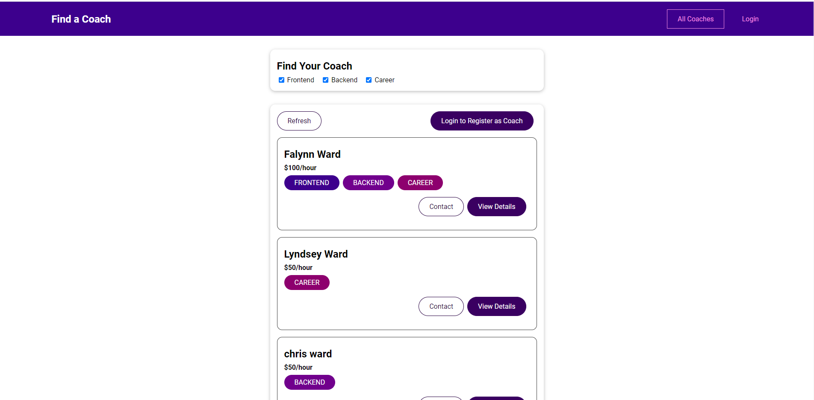
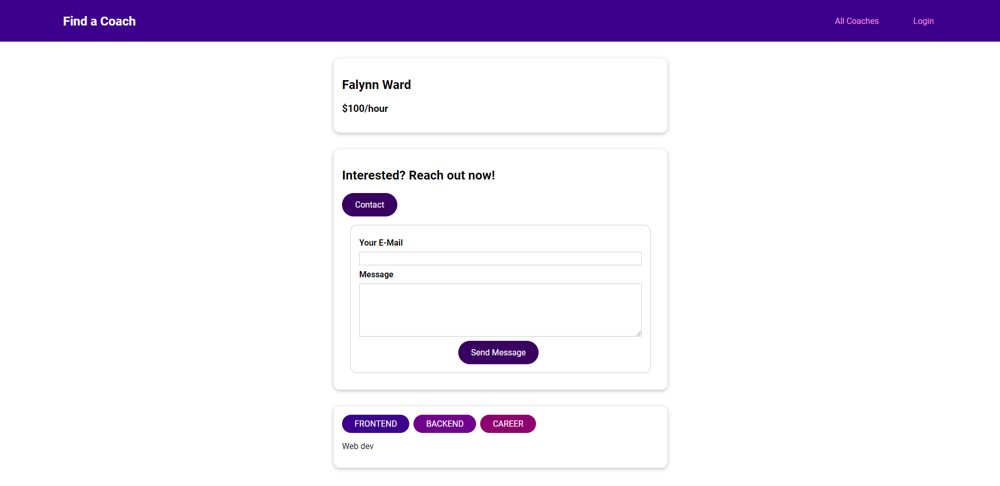
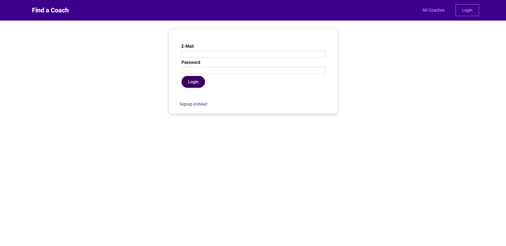
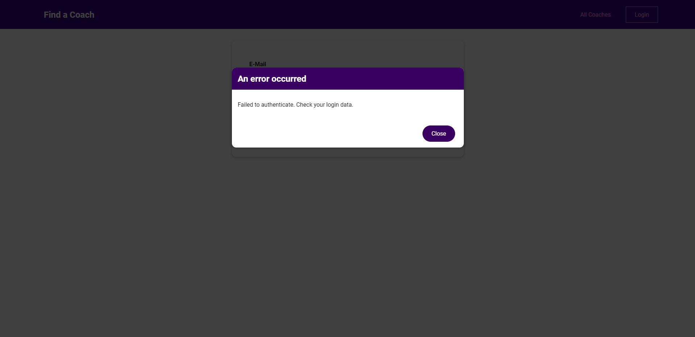
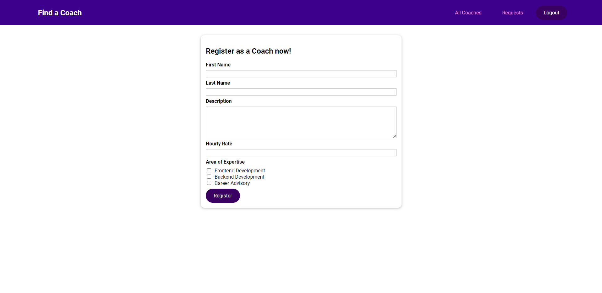
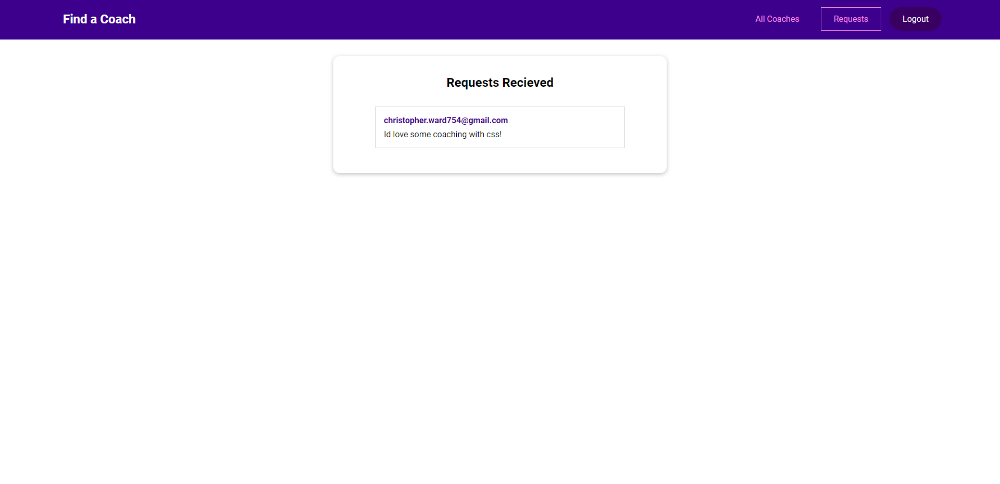

# Coach Finder App
- A coach finder app built using Vue.js, Vuex, and Firebase.

You can find a live version of this build [**Here**](https://coach-finder-f5223.web.app)

## Features

- User Authentication (with Vuex and Fireauth).
- Realtime Dynamic Data (with Realtime Database).
- State Management with Vuex.
- Fully Responsive Front-end.
