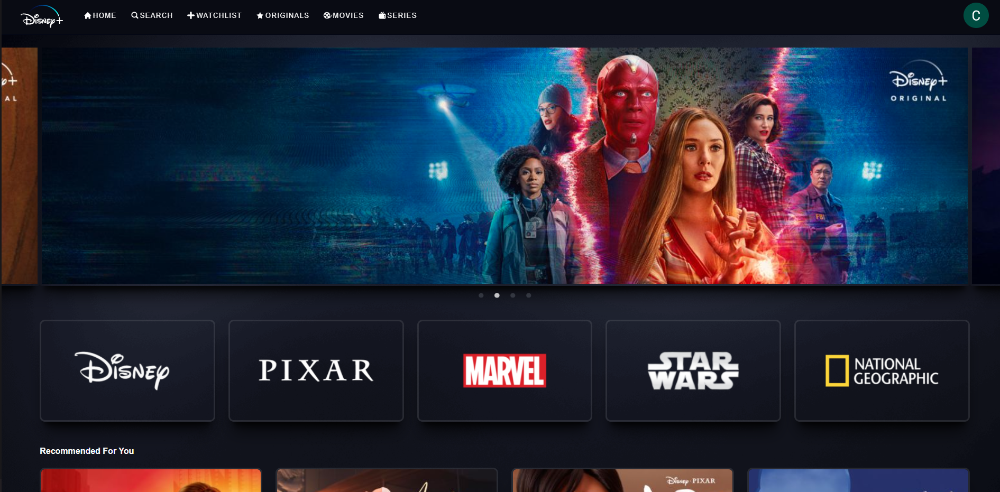
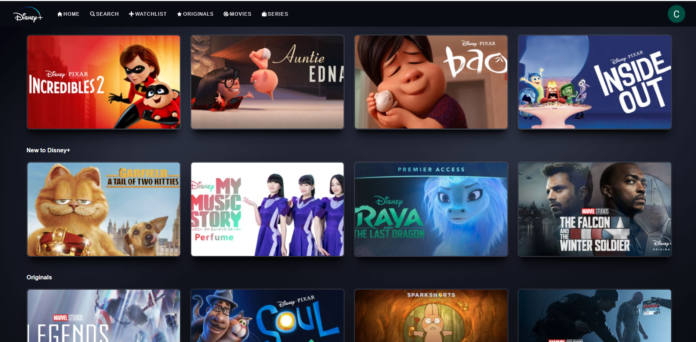
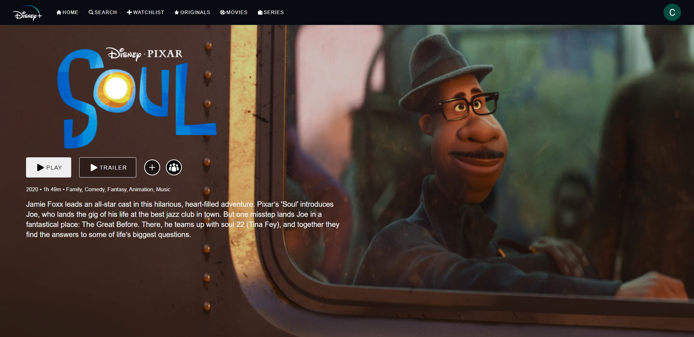

# Disney+ Clone
- Disney+ Clone using React.js and Redux.

[**Live Demo**](https://disney-clone-9cdd5.web.app/)

## Features

- User Authentication (with Redux and Fireauth)
- Realtime Dynamic Data (with Firestore)
- Interactive Components (with React Styled Components)
- Fully Responsive Front-end

## Technologies

- React.js
- Redux
- Firebase