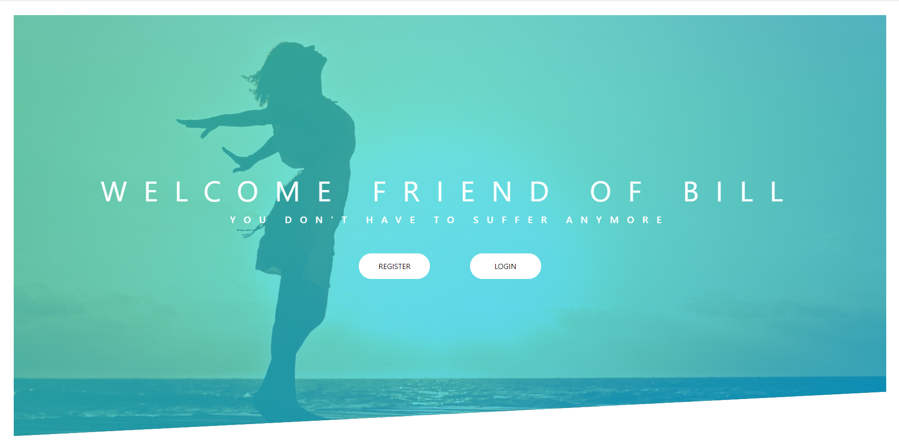
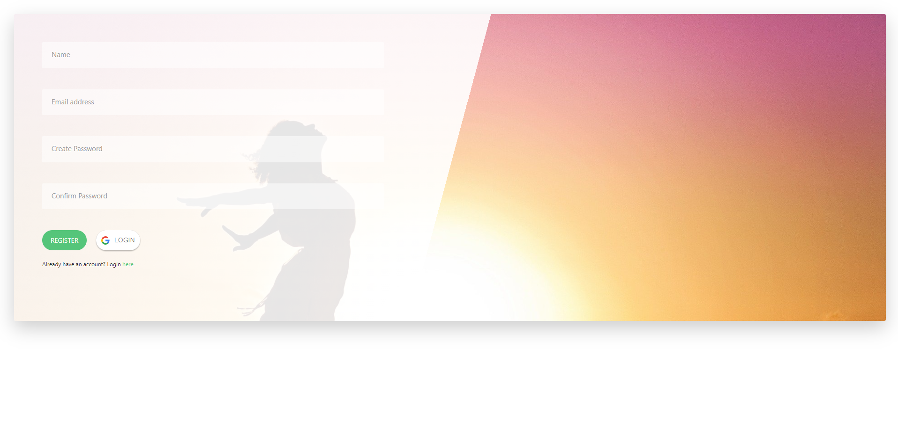
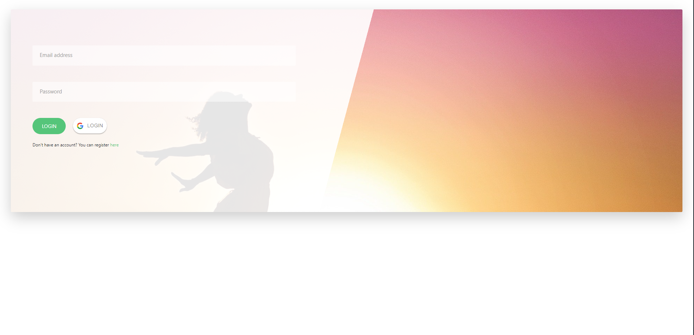
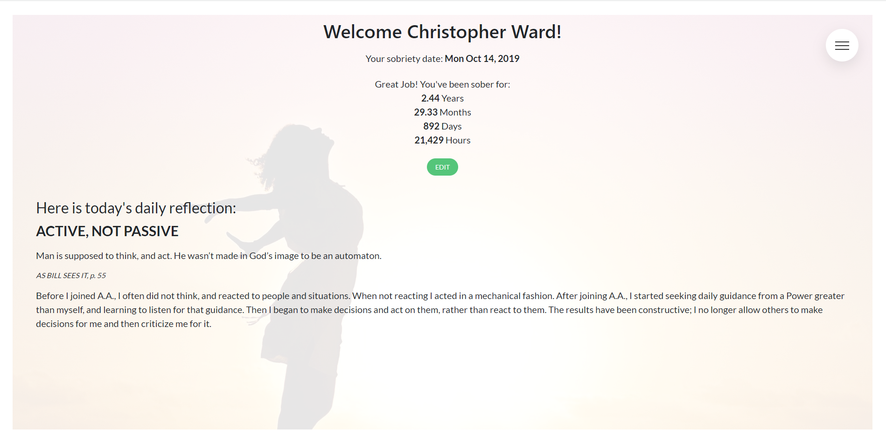
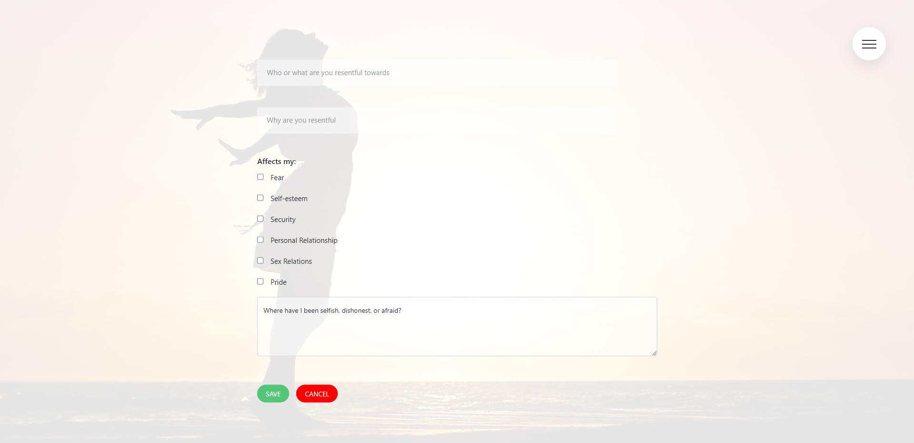
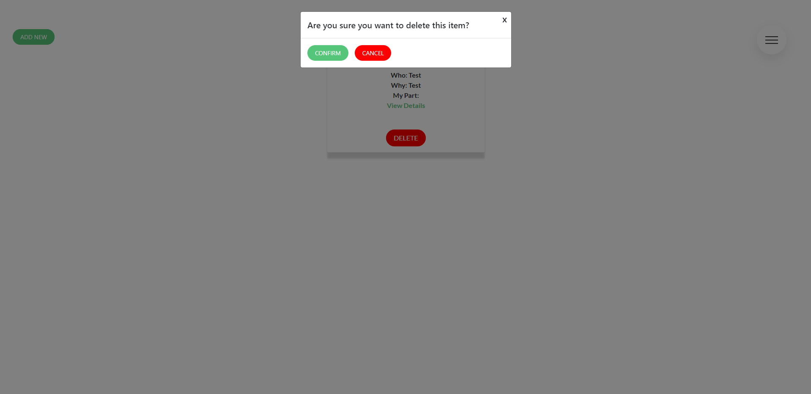
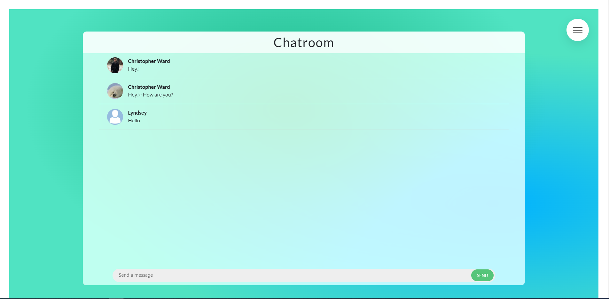
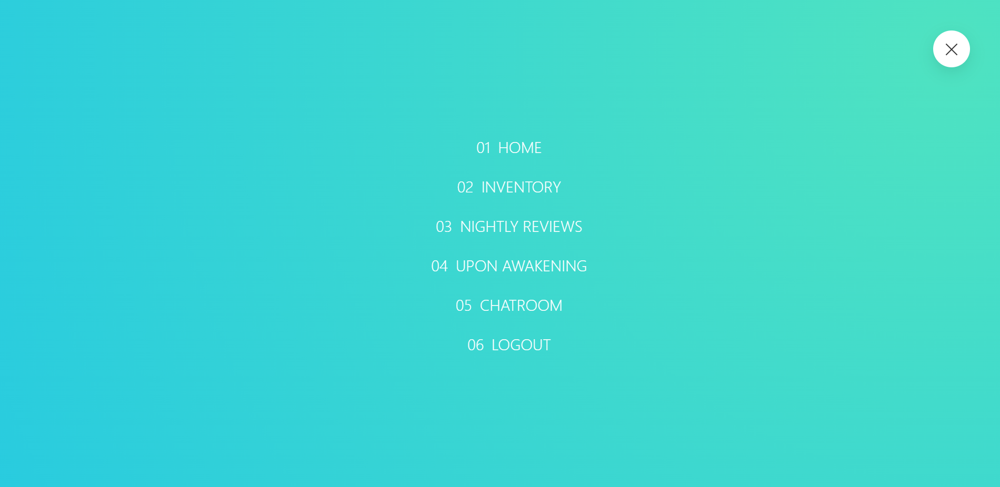

# Friend of Bill
- This is a sobriety app built using a MERN stack.

You can find a live version of this build [**Here**](https://friend-of-bill-v2.herokuapp.com/)

## Features
- User Authentication (with Passport.js and Google O-Auth).
- Full CRUD functionality.
- Interactive messages for user.
- Realtime Chatroom built using socket.io.
- Fully Responsive Front-end.
- Backend built using REST API conventions
- Web Scraping with Cheerio and Request modules.

## Technologies
- React.js
- Redux
- MongoDB
- Express
- Node
- Socket.io
- React Portals
- Higher Order Components
- Passport.js