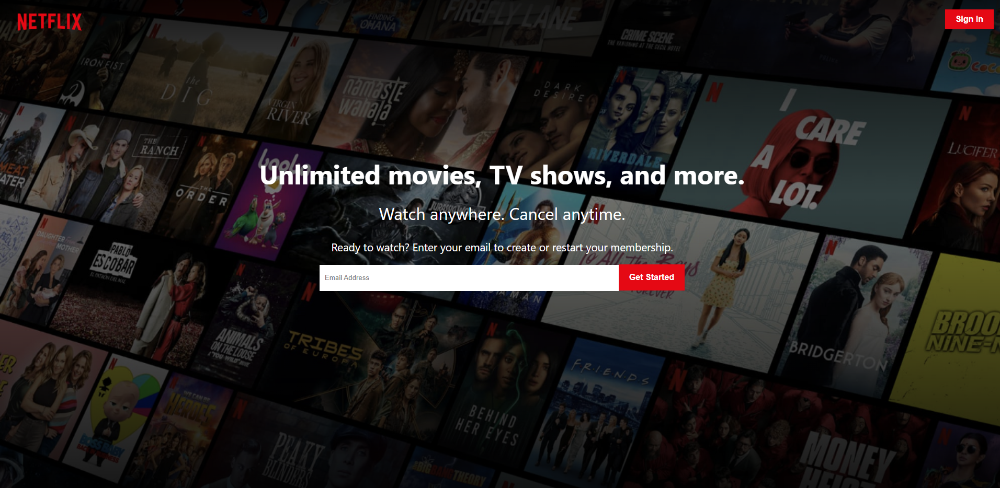

# Netflix Clone
- Netflix Clone built using React.js and Redux.

You can find a live version of this build [**Here**](https://netflix-clone-e83ae.web.app/)

## Features
- User Authentication (with Redux and Fireauth)
- Dynamic Data (with Firestore)
- Fully Responsive Front-end
- Payment processing with Stripe

## Technologies
- React.js
- Redux
- Firebase
- Stripe