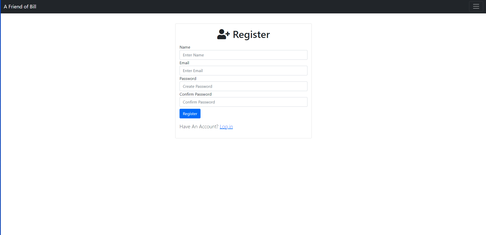
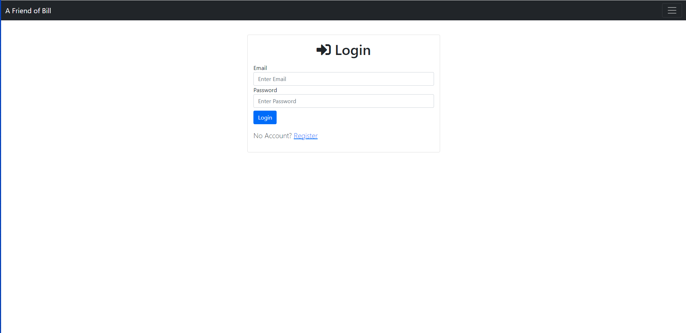
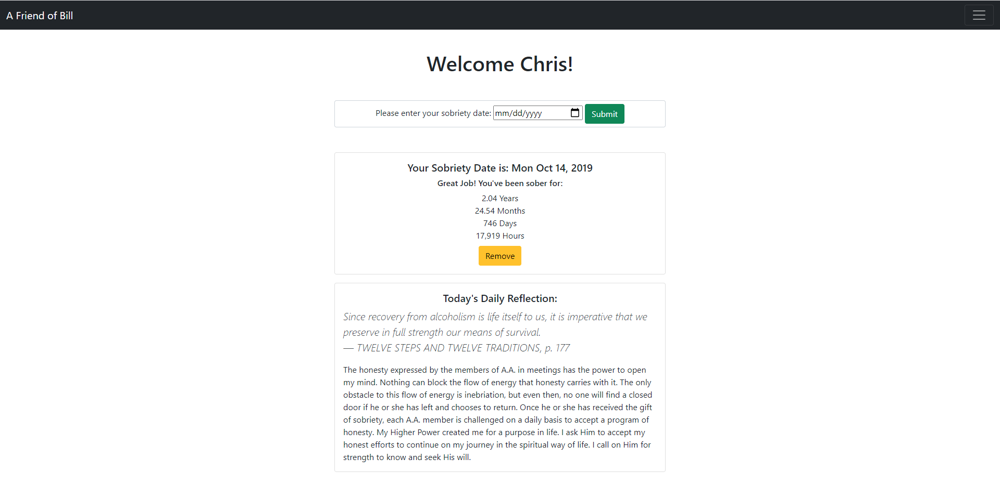
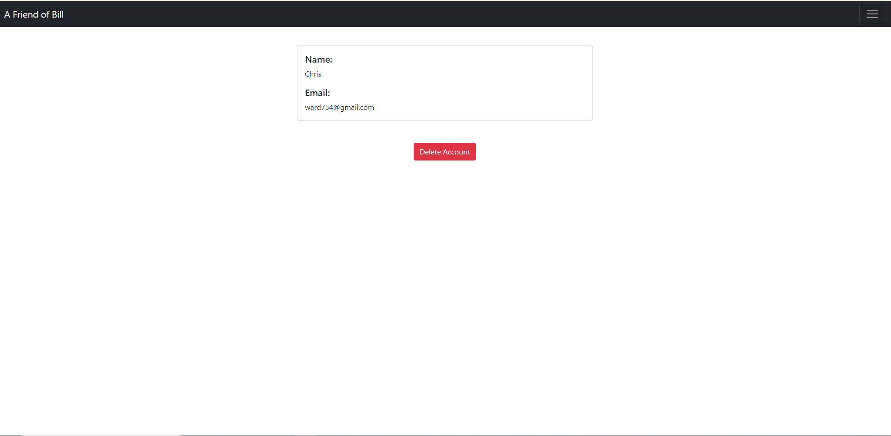

# Friend of Bill
- Sobriety App built with back-end technologies.

You can find a live version of this build [**Here**](https://friend-of-bill.herokuapp.com/)

## Features
- User Authentication (with Passport.js)
- Fully Responsive
- CRUD functionality

## Technologies
- Express
- Ejs
- Passport
- MongoDB